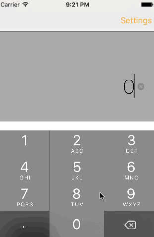

# Pre-work - TipCalculator

TipCalculator is a tip calculator application for iOS.

Submitted by: Isis Moran

Time spent: ~25 hours spent in total

## User Stories

The following **required** functionality is complete:

* [x] User can enter a bill amount, choose a tip percentage, and see the tip and total values.
* [x] Settings page to change the default tip percentage.

The following **optional** features are implemented:
* [x] UI animations
* [x] Remembering the bill amount across app restarts (if < 10mins)
* [x] Using locale-specific currency and currency thousands separators.
* [x] Making sure the keyboard is always visible and the bill amount is always the first responder. This way the user doesn't have to tap anywhere to use this app. Just launch the app and start typing.

The following **additional** features are implemented:

- [x] Included the round up option (where users can round up the total using the tenths value)
- [x] Included the option to split the bill (the app allows the user to split the bill for up to twenty people)
- [x] Included the option to allow the user to customize tip percentage they'd like to apply to the total
- [x] Added an app icon

## Video Walkthrough

Here's a walkthrough of implemented user stories:

GIF created with [LiceCap](http://www.cockos.com/licecap/).

## Notes

Describe any challenges encountered while building the app:

This was my first try at the Swift language, so naturally, it was a bit challenging. One thing that really got me was the animation portion. When I failed to get the animation going, I originally thought that the code for my animation would be flawed...I did not think that the rest of the code would be responsible for its lack of function (I saw blocks of code as independent functions, not part of a whole). All in all I learned not only about the Swift programming language, but also how to better my debugging skills and ability to find ways to make my code more coherent. I now see blocks of code as a working machine as opposed to separate pieces completely. Although I must admit, it was quite difficult to get information from online sources, since many of them contained outdated codes and options that were no longer supported by the new Xcode. Overall, a great learning experience!

## License

    Copyright [2015] [Isis Moran]

    Licensed under the Apache License, Version 2.0 (the "License");
    you may not use this file except in compliance with the License.
    You may obtain a copy of the License at

        http://www.apache.org/licenses/LICENSE-2.0

    Unless required by applicable law or agreed to in writing, software
    distributed under the License is distributed on an "AS IS" BASIS,
    WITHOUT WARRANTIES OR CONDITIONS OF ANY KIND, either express or implied.
    See the License for the specific language governing permissions and
    limitations under the License.
